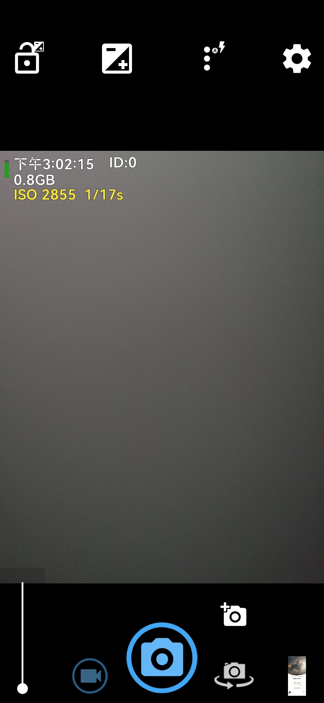
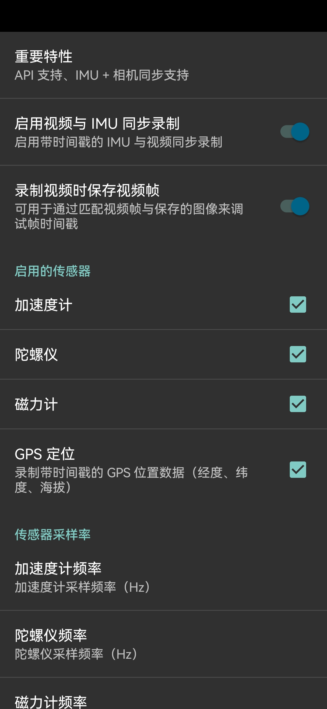
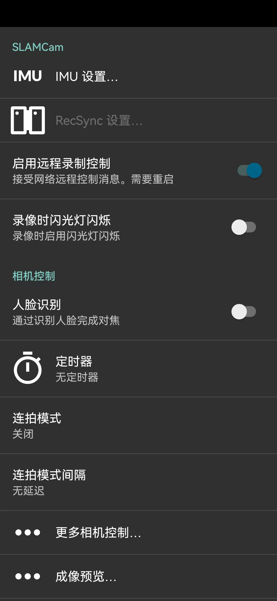

---

# SLAMCam

SLAMCam is a secondary development based on **OpenCamera**, designed to support **synchronized recording of IMU, GPS, and video streams**.
All sensor data are aligned on a **unified timeline**, making it suitable for **SLAM** and **Visual-Inertial Odometry (VIO)** research.
The software also supports a **Chinese (Simplified) user interface**.

  
  
  

---

## Features

* Synchronized IMU, GPS, and video recording
* Real-time timestamping for sensor data
* Remote control and multi-device synchronization (RecSync)
* Chinese (Simplified) UI support

---

## Requirements

* Android device with **full Camera2 API support**
* Optional: Wi-Fi connection for remote recording or multi-device sync

---

## Usage

### 1. IMU Recording

> **Note:** Synchronized timestamps for camera and IMU are not supported on all devices. Check support in preferences.

Steps:

1. Open **Preferences** → enable **Camera2 API** → enable **"Sync video IMU recording"** in IMU settings.
2. (Optional) Disable **video stabilization** to minimize preprocessing effects.
3. (Optional) Enable **save frames** to verify recorded data.
4. (Optional) Enable **flash strobe** and set frequency in additional sensor settings.
5. Switch to **video mode**, adjust ISO and exposure as needed.
6. **Record video**.
7. Retrieve recorded data from `DCIM/SLAMCam/{VIDEO_DATE}/`:

   * `{VIDEO_NAME}_gyro.csv` – `X, Y, Z, timestamp (ns)`
   * `{VIDEO_NAME}_accel.csv` – `X, Y, Z, timestamp (ns)`
   * `{VIDEO_NAME}_magnetic.csv` – `X, Y, Z, timestamp (ns)`
   * `{VIDEO_NAME}_timestamps.csv` – `timestamp (ns)`
   * `{VIDEO_NAME}_flash.csv` – `timestamp (ns)` (flash firing timestamps)

---

### 2. Remote Recording

Steps:

1. Connect your smartphone and PC to the **same network**.
2. Use scripts in `./api_client/` to send requests to SLAMCam.

   * The `phase` returned by `start_recording` can be used for synchronization with external devices.
     

---

### 3. Multi-Device Synchronized Recording (RecSync)

> **Important:** Devices must support real-time timestamping. Check "Timestamp source" in RecSync preview (should display "realtime").
> Leader device manages timing; client devices follow the leader.

#### Leader Device Setup

1. Start a **Wi-Fi hotspot**.
2. Open SLAMCam → Preferences → **RecSync settings** → enable **"Use RecSync"**.
3. (Optional) Enable **phase alignment** for higher synchronization precision (< half frame).
4. (Optional) Configure **camera settings broadcast** in "Sync settings".
5. Switch to **video mode**, adjust camera settings, and press **settings synchronization**.
6. Wait for clients to connect.
7. (If phase alignment enabled) Press **phase alignment button**; wait until "Phase error" turns green.
8. **Start recording**.

#### Client Device Setup

1. Connect to the leader's **Wi-Fi hotspot**.
2. Open SLAMCam → Preferences → **RecSync settings** → enable **"Use RecSync"**.
3. Adjust camera settings not broadcasted by leader.
4. Wait for leader to start recording.

> *Phase alignment must be performed before every recording session.*

---

## Best Practices

* **Audio recording is disabled** to avoid extra frames caused by MediaRecorder audio-sync issues.
* Disable **video stabilization** and **OIS** to reduce preprocessing and improve data consistency.

---

